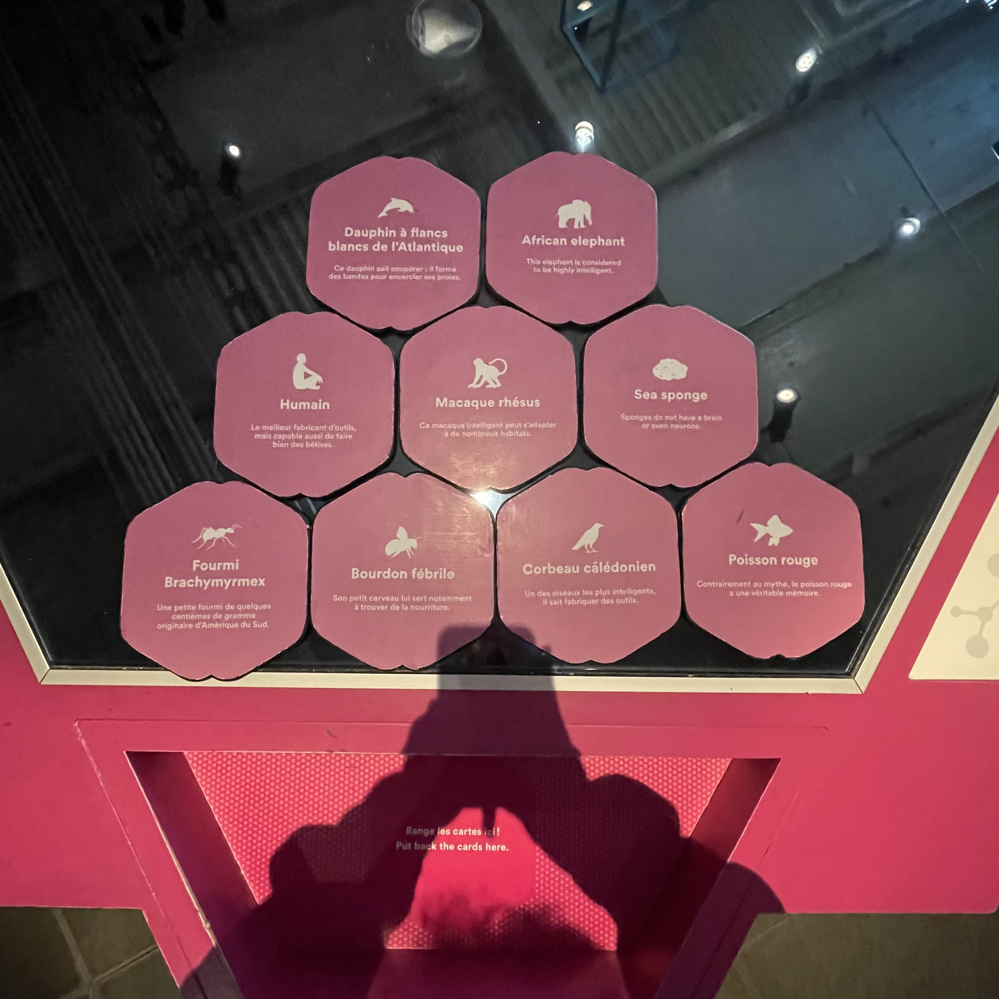
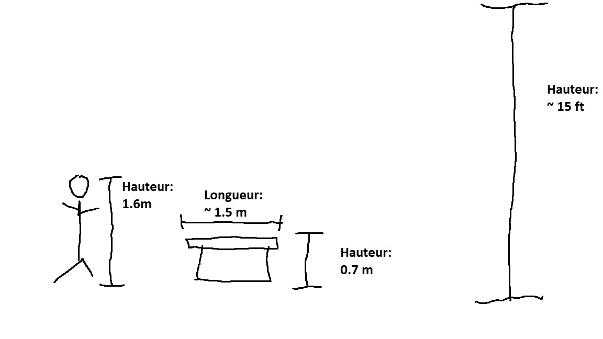
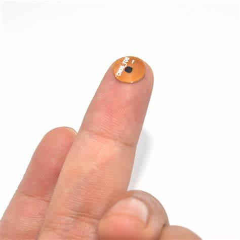
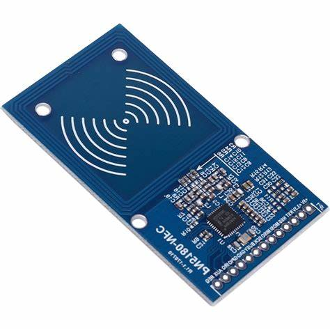
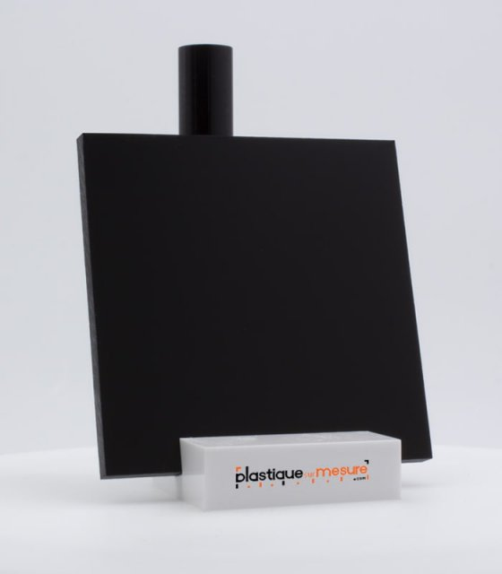
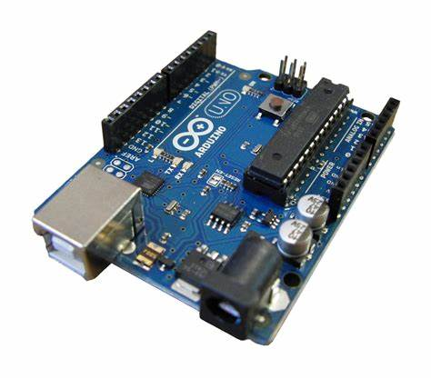
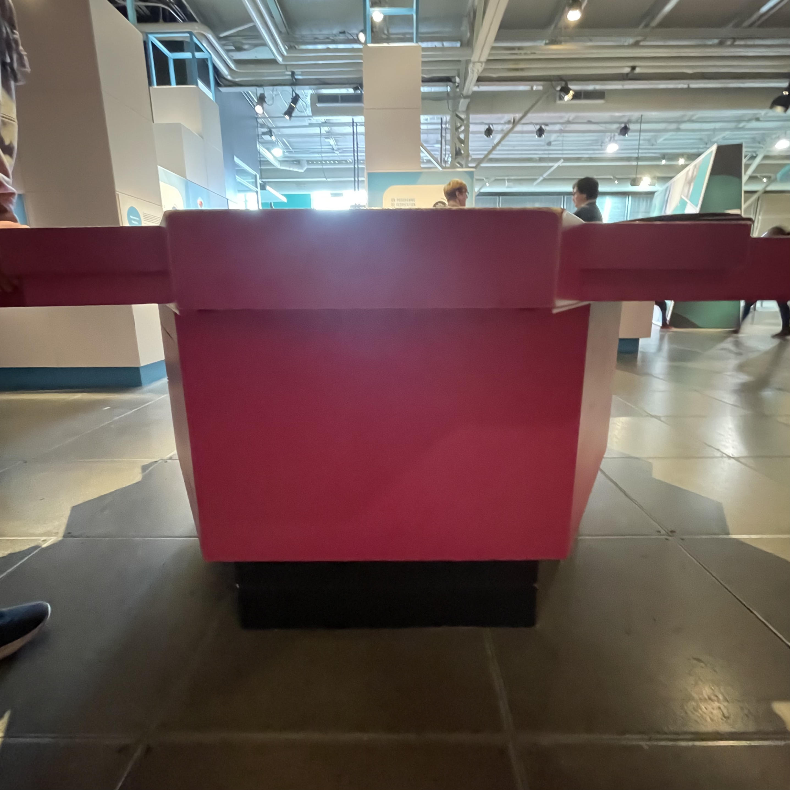
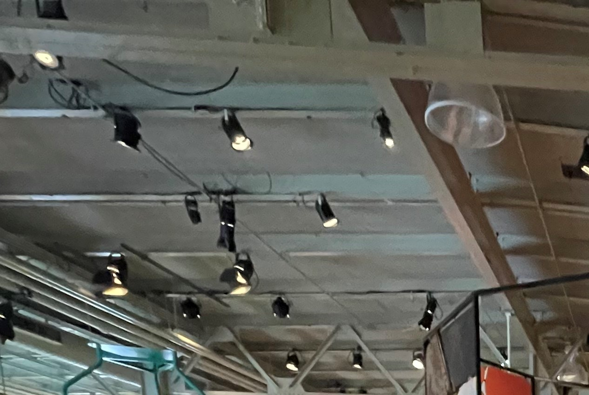

# Humain

[Source de l'affiche](https://lienmultimedia.com/spip.php?article50730)

## Lieu de mise en exposition
Centre des sciences de Montréal

Source: Mégane Ranger, 2023

## Type d'exposition 
Permanente et intérieur

## Date de votre visite		
12 Avril 2023

## La Grosse Tête/Got A Big Head?

## Noms des artistes
* Équipe multimédia du Centre des sciences de Montréal

## Année de réalisation
~2015

## Description de l'oeuvre	
On croit souvent que l'intelligence humaine s'explique par la taille du cerveau. La taille a bien sûr son importance. Mais d'autres animaux ont un cerveau plus gros que le nôtre, et pourtant, ils ne construisent pas de gratte-ciels ou de fusées. L'intelligence dépendrait-elle plutôt de la taille du cerveau par rapport à celle du corps?

Source: Cartel

## Type d'installation
Intéractive

## Fonction du dispositif multimédia (scénographie, mise en valeur, mise en contexte, support pédagogique, diffusion du patrimoine immatériel)
Support Pédagogique. 
Son but est d'apprendre aux visiteur du musée quel animal à le plus gros cerveau tout en les laissant "jouer".

## Mise en espace	
Vue d'ensemble de la pièce 

Dimensions :

L'oeuvre est placé dans le milieu de la pièce de l'exposition Humain. Ele est placé directement sur le plancher et occupe l'espace d'une petite table.

## Composantes et techniques	
Parties composantes de l'oeuvre

* Puces NFC (pour les plaques contenant les informations sur les animaux)

[Source de l'image](https://www.alibaba.com/product-detail/small-size-ntag213-nfc-rfid-tag_60716307945.html)

* Senseur NFC (pour détecter les puces NFC)

[Source de l'image](https://www.ebay.com/p/25033762107?iid=353374133969)

* LED (pour illuminer les réponses déja graver sur l'oeuvre)

[Source de l'image](https://www.aliexpress.com/item/32910554366.html)

* Plexiglass fumé (pour cacher les choix non-illuminé)

[Source de l'image](https://plastiquesurmesure.com/plaque-plexiglass-sur-mesure-plexiglass-coule/1935-plaque-plexiglass-transparent-fume-marron-fonce-brillant-coule-5mm.html)

* Arduino (pour stocker les informations des NFC)

[Source de l'image](https://commons.wikimedia.org/wiki/File:Arduino-uno-perspective-transparent.png)

* Bois

Techniques:

Les réponses sont pré-gravé sur des différentes couches de plexiglass, donc il n'avait pas besoin de lumières complexes pour illuminer les réponses.

## Éléments nécessaires à la mise en exposition
Autocollant pour position des pieds

Lumière pour illuminer l'oeuvre

## Expérience vécue

La posture recommendé pour le visiteur est: debout, les pieds sur l'autocollant. L'autocollant indique la direction que le visiteur doit avoir pour pouvoir intéragir avec l'oeuvres et voir les réponses. Le visiteur est attendu de prendre des pièces hexagonale qui contiennent les informations de divers animaux, et d'ensuite les placer un à un sur un senseur, qui indiquera ensuite s'il s'agit du bon animal. Pour chaque animaux, une couche de plexiglass s'illuminera et indiquera des informations sur l'animal placé. 

Vidéo:

## ❤️ Coup de coeur
Ce qui m'a plu s'agit de l'universalité du projet. L'information qu'il traite s'agit de quelque chose dont tous le monde devrais savoir, mais personne le sait. Donc, il permet d'apprendre aux jeunes ET MÊME aux adultes. Un autre point qui m'a plus est la gravure des réponses dans le plexiglass. L'artiste aurait pu créer un système d'illumination hyper-compliqué, qui allume les diverse parties de l,oeuvre, mais il a plutôt gravé des plexiglass et passé une lumière à travers, sauvant beaucoup de temps à la création et l'entretien, car une lumière individuelle brisé est plus facile à réparé qu'une lumière dans un gros système de style "banderole"

## 🤔 Les parties mauvaises
Je trouve que l'oeuvre est trop basse au sol, j'avais dû me plier le corps au complet pour intéragir avec. Personellement, je l'aurais élargis d'au moins 30 cm du sol et ajouter un escalier pour les plus petits qui veulent voir l'oeuvre.

## Références		hyperliens vers les sites consultés
[Centre Des Sciences de Montréal](https://www.centredessciencesdemontreal.com/exposition-permanente/humain)

