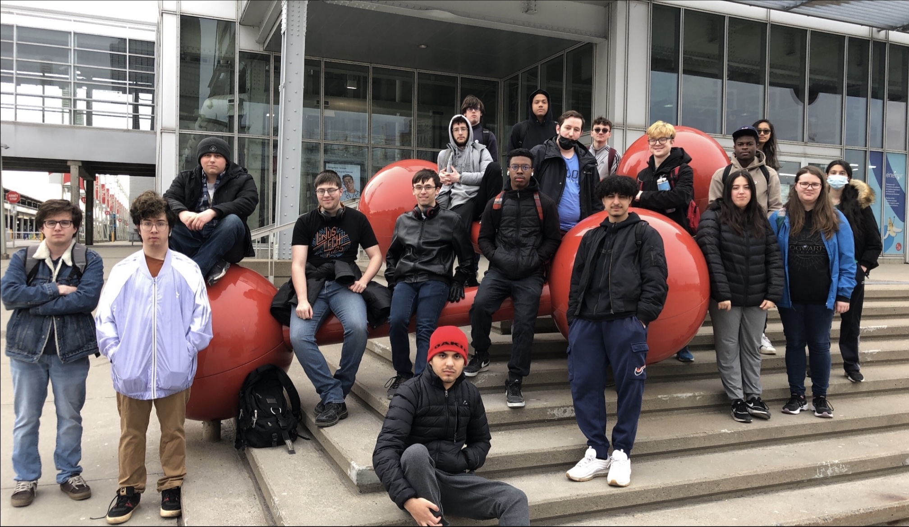
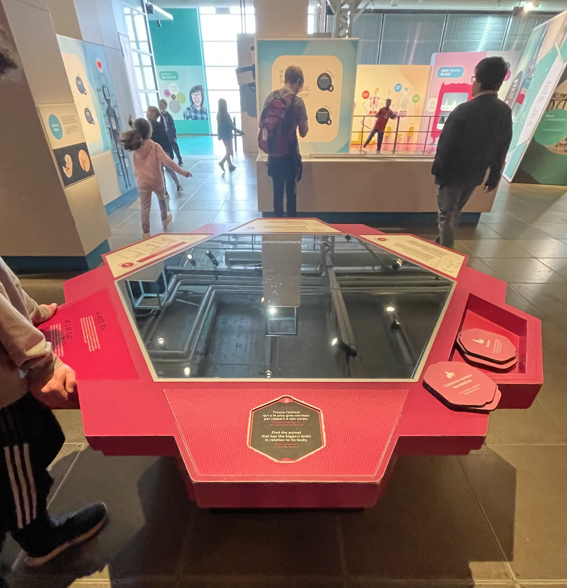
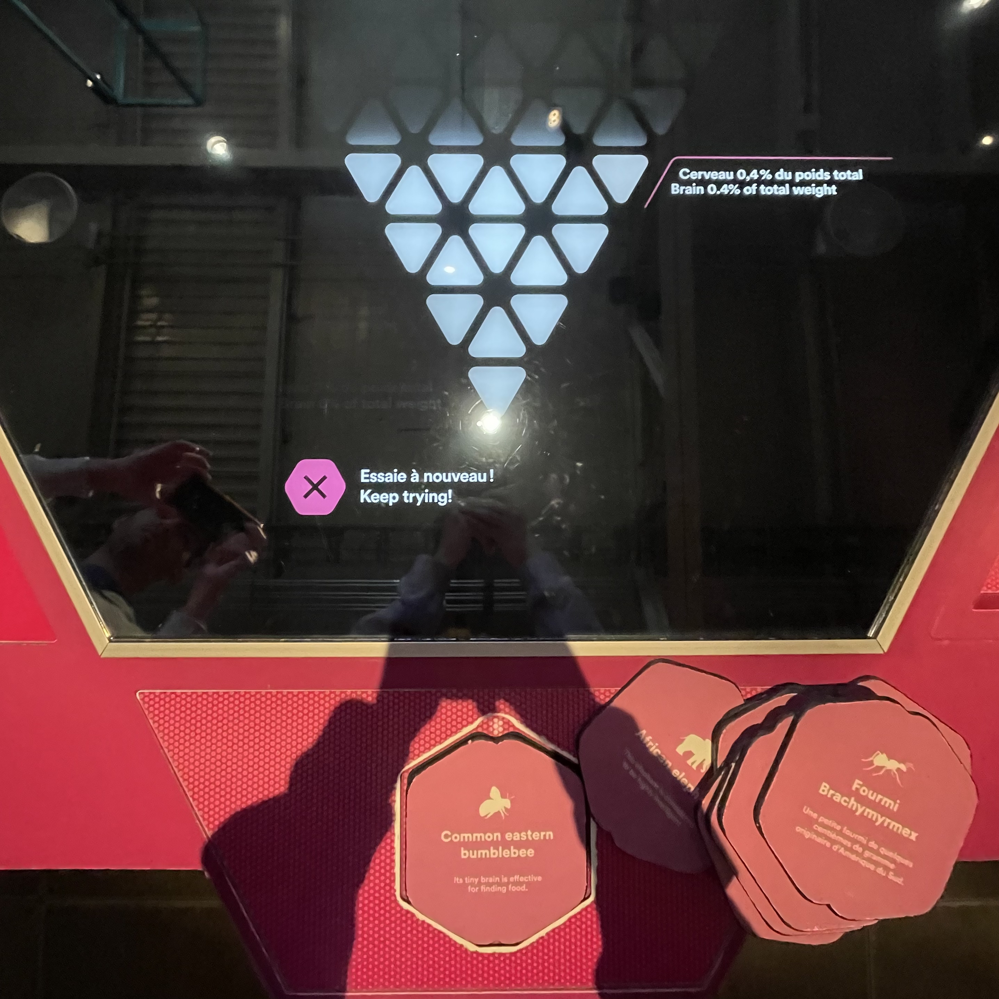
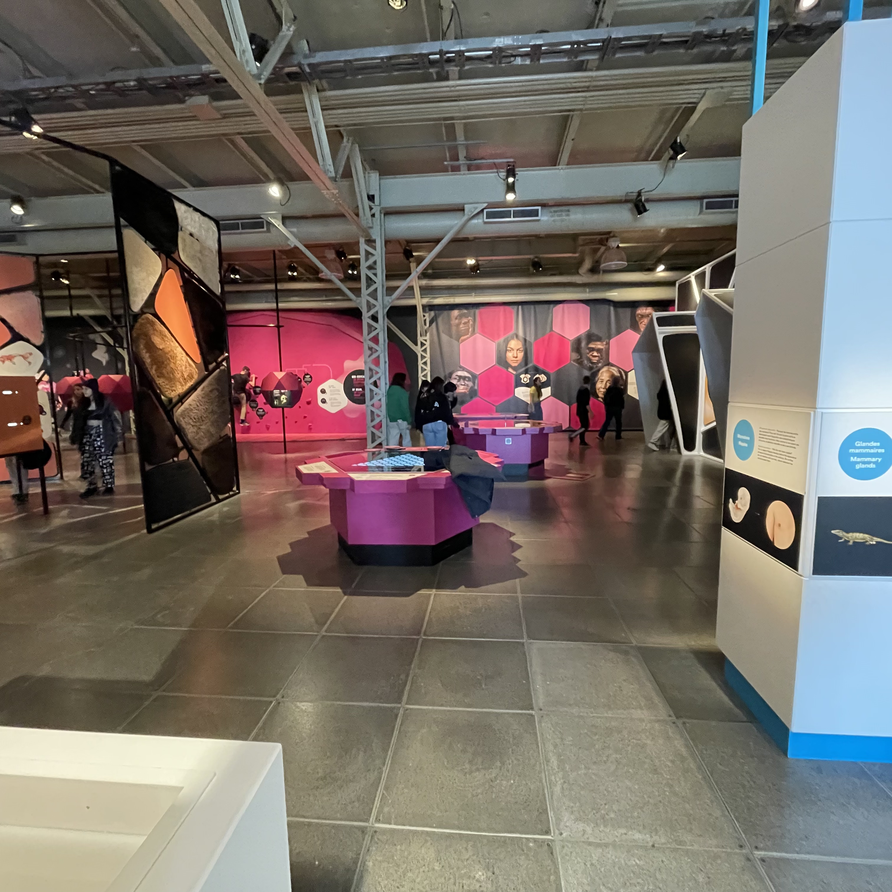
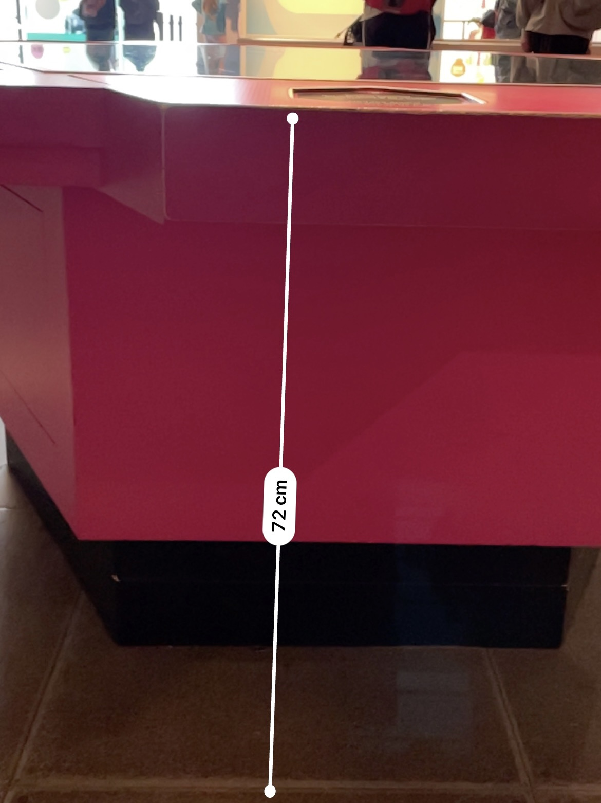
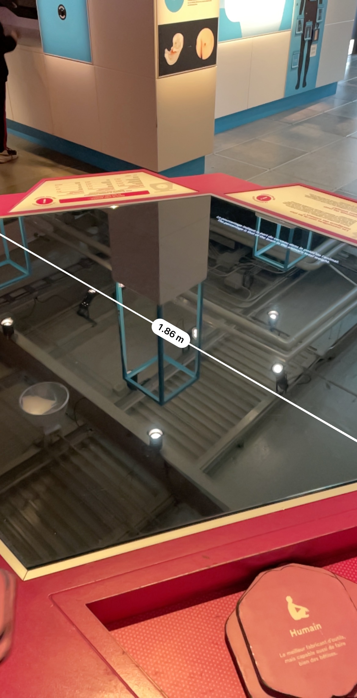
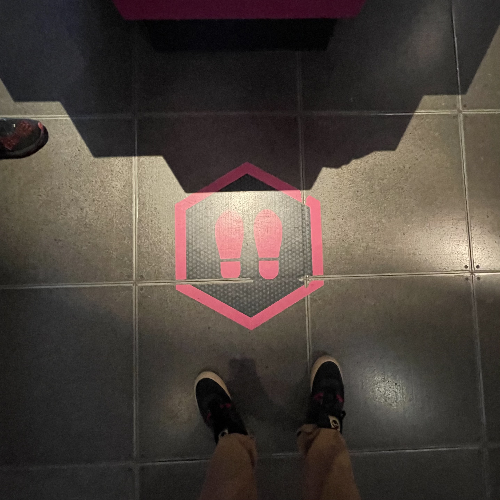

# Humain

[Source de l'affiche](https://lienmultimedia.com/spip.php?article50730)

## Lieu de mise en exposition
Centre des sciences de Montréal

Source: Mégane Ranger, 2023

## Type d'exposition 
Permanente et intérieur

## Date de votre visite		
12 Avril 2023

## La Grosse Tête/Got A Big Head?

## Noms des artistes
* Équipe multimédia du Centre des sciences de Montréal

## Année de réalisation
~2015

## Description de l'oeuvre	
On croit souvent que l'intelligence humaine s'explique par la taille du cerveau. La taille a bien sûr son importance. Mais d'autres animaux ont un cerveau plus gros que le nôtre, et pourtant, ils ne construisent pas de gratte-ciels ou de fusées. L'intelligence dépendrait-elle plutôt de la taille du cerveau par rapport à celle du corps?

Source: Cartel

## Type d'installation
Intéractive

## Fonction du dispositif multimédia (scénographie, mise en valeur, mise en contexte, support pédagogique, diffusion du patrimoine immatériel)
Pédagogique. 
Son but est d'apprendre aux visiteur du musée quel animal à le plus gros cerveau.

Vidéo:

## Mise en espace	
Vue d'ensemble de la pièce 

Dimensions 

Texte qui permet de comprendre comment l'oeuvre ou le dispositif est mis en espace : dans quelle pièce, sur quel mur, quel est l'espace occupé, comment est-ce disposé... ?

## Composantes et techniques	
Parties composantes de l'oeuvre (il est possible d'utiliser des images tirées de sites internet pour faciliter la compréhension si les photos prises ne sont pas claires)	

Techniques:
Les bases des poteaux peuvent facilement se dé-viser pour faciliter le transport. La majorité des éléments sont attacher avec des zip-ties ou avec des attache dévisable.

## Éléments nécessaires à la mise en exposition

Autocollant pour position des pieds

## Expérience vécue

Le visiteur pouvait avoir n'importe quelle posture qu'il voulait en autant qu'une partie de son corps fut détecté par un senseur.

Vidéo:

----------------------------------------------------------

## ❤️ Ce que j'ai aimé et m'a inspiré
Ce qui m'a plu sont les différentes animations qui se passent dépendant d'oû on est placé plutôt qu'en avoir seulement une qui se passe tout le temps.
J'ai aussi aimé la disposition des poteaux, faisant en sorte qu'ils ne sont pas encombrant au élèves qui vont à la terrace. Ce qui m'a inspiré est comment elle fondait avec l'environnement: les gens qui étaient alentour ni portait peu d'attention et continuait à relaxer comme si rien n'était.

## 🤔 Ce que je n'ai pas aimé et que je ne garderais pas
Je n'ai pas aimé l'emplacement de l'oeuvre, car elle a été placé à un endroit très fréquenté, faisant en sorte qu'on ne pouvait pas expérimenter l'oeuvre dans son entièreté puisqu'une partie était toujours enclenchée par une personne qui bougeait. J'aurais choisi un endroit moins acchalandé, comme le parc en arrière du Collège Montmorency.

## Références		hyperliens vers les sites consultés
[Centre Des Sciences de Montréal](https://www.centredessciencesdemontreal.com/exposition-permanente/humain)

