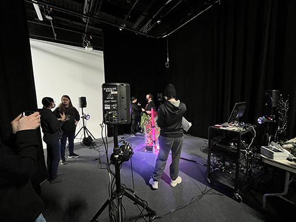
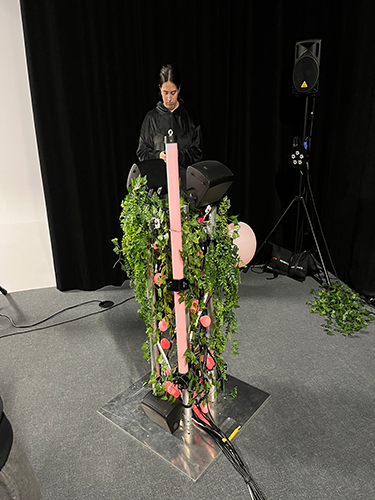
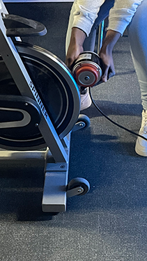

## Les projets:
* Échomarine
* EDRIA 
* Luma Sol 
* Nexum  
* Zodie-Gal

## Le lien de chacun avec le thème Mycélium:
Le mycélium est la partie végétative et souterraine des champignons et joue les rôles de décomposeur de la matière organique et d'absorbeur de nutriments et d'eau.

Échomarine
* L'oeuvre porte sur les fonds marins et sa population en voie d'extinction. Le lien avec Mycélium serait la végétation marine.

EDRIA
* L'oeuvre est parsemée de champignons lumineux représentant la fin de la boucle de l'industrialisation, puisque les champignons sont la dernière étape du cycle de la vie. 

Luma Sol 
* L'oeuvre veut démontrer l'importance pour les humains de demeurer en contact avec la nature. Le lien qu'on peut faire serait le cycle que Mycélium fait (décomposer l'organique et absorber des nutriments de la nature).

Nexum; 
* L'oeuvre combine l'humain et la nature comme le Mycélium fait (décompose l'organique et absorbe des nutriments de la nature)

Zodie-Gal; 
* Aucune idée

## L'installation en cours dans les studios pour chacun des projets 

**Échomarine (vidéo)**; 

**EDRIA (photos)**;  

Crédit: Martin Soltan

**Luma Sol (vidéo et photos)**; 

**Nexum (vidéo)**; 

**Zodie-Gal**; 
Pas d'installation en cours.

## Le schéma de l'installation prévue (insérer le schéma de plantation de chacun des projets, avec la source)

[Échomarine](https://github.com/Echomarine/Echomarine/tree/main/docs/preproduction)

    
[EDRIA](https://github.com/F-C-A/EDRIA/tree/main/docs/preproduction)

[Luma-Sol](https://github.com/Kawabongaaa/LumaSol/tree/main/docs/preproduction)

[Nexum](https://github.com/Boucle-RDDL/Nexum/)

[Zodie-Gal](https://github.com/tim-montmorency/66B-modele_de_projet/tree/main/docs/preproduction)

## 3 cours du programme nécessaire pour créer les projets:
* Objets interactifs
* Web 5
* Traitement audiovisuel

## Une composante technique utilisé dans un projets dont je ne connais pas:
**Les sensors.**

Il y a différents types de sensors: proximité, humidité, chimique, lumière et mouvement.
Ceux qui seront le plus utilisé dans les projets s'agit de sensors de mouvement. 
Les 3 types de sensors de mouvement les plus utilisé sont: Passive Infrared (PIR), Microwave et Hybrid.
Les sensors PIR ont un sensor pyroelectrique qui détecte le niveau de radiation infrarouge (chaleur). Le corp humain emet beaucoup de chaleur, alors le sensor déclenche lorsque sa chaleur est détecté.
Les sensors Microwave envoie des ondes de radiation micro-ondes pour détecter des mouvement, comme les laser de la police.  Il envoie une fréquence radio élevée et mesure la réflexion d’un objet en détectant un décalage de fréquence. S’il détecte un changement de fréquence, le détecteur de mouvement est activé.
Les sensors Hyvrid utilise PIR et Microwave. Il est utilisé comme sécurité pour empecher l'un des sensors de s'activer lorsqu'il ne devrait pas (vent, chaleur, etc).

[Site informatif sur les sensors de mouvement](https://www.arrow.com/en/research-and-events/articles/how-motion-sensors-work)

[Pyroélectricité](https://en.wikipedia.org/wiki/Pyroelectricity)

## Projets en rang de préférence: (avec justification)
* EDRIA
Selon moi, EDRIA semble être le projet le plus pensé entre eux. Elle est la plus grosse installation avec le plus d'intéractivité.

* Luma-sol
Luma-Sol était un sérieux concurrent pour la première place, mais j'ai du le mettre en deuxiême place car je pense qu'elle va durer moins longtemps que EDRIA. Luma-Sol a plus de chance d'un bris que les autres, car les pièces mécanique du vélo peut se briser très facilement si on n'y fait pas attention. Aussi, je pense qu'il y a une bonne chance que le vélo se fasse voler puisqu'il ne pese pas très lourd, faisant en sorte que l'oeuvre ne pourra plus fonctionner.

* Zodie-Gal
Zodie-Gal a de très bonnes chance d'être quelque chose de super. J'aime bien leur concept et les illustrations du jeux, mais il n'y avait rien de prêt lors de visite au studio. Je ne sais pas comment le jeux va être, alors je le garde comme 3e choix, entre bien et mauvais.

* Échomarine
Cette oeuvre me semble trop comme une oeuvre de musée, qu'on regarde juste car on est déja au musée. Je ne trouve pas que c'est quelque chose que je me déplacerais pour aller voir spécifiquement.

* Nexum
Je la trouve trop ordinaire. Lorsque je l'ai vu en studio, c'etait une simple guirlandes sur le plancher avec des lumières qui changeait de direction. Je trouve que c'est une version "cheap" de EDRIA et Luma-Sol

## Ce que je vais ressentir en expérimentant les projets: (avec justifications)

* EDRIA

Je vais ressentir de la curiosité. Je vais surement essayer de faire jouer toute les animations et de voir toutes les variantes de couleurs/musiques.
* Luma-sol

Je vais ressentir de l'essouflement. Comme une grande majorité de personnes qui voit un vélo dans une oeuvre intéractive, je vais essayer de pédaler le plus vite possible pour voir si les lumières et la musique sera affecté.
* Zodie-Gal

///
* Échomarine

///
* Nexum

Comme Luma-sol, je vais ressentir de l'essouflement. Je vais surement essayer de courrir le trajet le plus vite possible pour voir si les lumières et la musique sera affecté.
