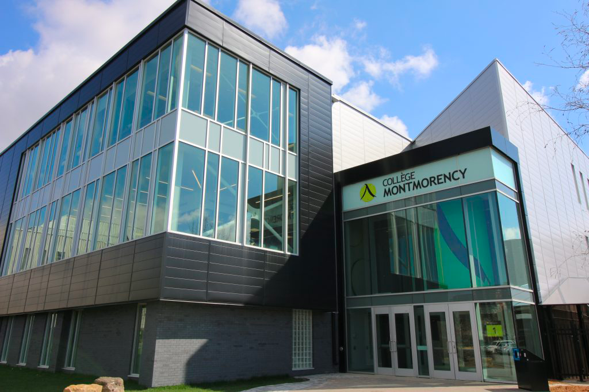
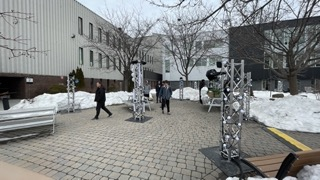
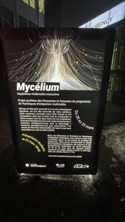
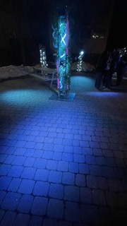

# Mycélium

## Lieu de mise en exposition
Collège Montmorency

## Type d'exposition 
Temporaire et extérieur

## Date de votre visite		
24 Février 2023 - 24 Mars 2023

## Titre de l'oeuvre
Edria

## Noms des artistes
* Elwin Durand
* Loic Delorme
* Dominic Roberts
* Gabriel Leblanc
* Meryem Berbiche
* Jean-Christophe Zephir

## Année de réalisation
2023

## Description de l'oeuvre	
Traversant un hiver froid et glacial, des explorateurs arrivent en terre inconnue : EDRIA. Des piliers se dressent, et un écosystème hors de ce monde se dévoile sous leurs yeux. Une structure centrale attire l’attention des explorateurs. Intrigués, ils rentrent dans cette espace insolite et s'approchent de la dite structure: des lumières s'allument, des sons se déclenchent, et il semblerait que la présence de plusieurs personnes soit nécessaire pour progresser... 

[Cartel de l'oeuvre](https://tim-montmorency.com/2023/projets/EDRIA/docs/web/index.html)

## Type d'installation
Intéractive

[

## Mise en espace	
Vue d'ensemble de la pièce 

![vue_ensemble]
![vue_ensemble_2]

Croquis de la mise en espace

	

put pics here

Liste des composantes
* 9x Poteaux
* Pont d'éclairage (cr34te)
* 9x speaker
* 8x string festoon 15' (cr34te)
* 9x fausse plante
* 2x arduino
* LED ALITOVE DC 12V WS2811 12mm
* Lumières adressables (x4)
* DMX Dot 5W (cr34te)
* (~8x25' 1x 50') DMX DOT STRING festoon  (cr34te)
* 64x DMX DOT clean (cr34te)
* 20-25x Boule Lumineuse 200mm (cr34te)
* 1x Boule Lumineuse 36' cr34te)
* 4x Tubes Opal 0.5M (cr34te)
* 2x Tubes Opal 1M (cr34te)
* 8x COLORado 2 Solo (cr34te)
* mac mini
* Carte de son
* Amplificateurs
* V-Show Artnet RDM DMX Controller
* routeur
* 2x CL-PBDF (cr34te)

Techniques

## Éléments nécessaires à la mise en exposition
Piliers 

![pillier]

Cache-fils

## Expérience vécue
Posture du visiteur ou gestes de l'interacteur 

![posture]

[Vidéo sur la posture]

## ❤️ Ce qui vous a plu, vous a donné des idées
Ce qui m'a plu sont les différentes animations qui se passent dépendant d'oû on est placé plutot qu'en avoir seulement une qui se passe tout le temps.

## 🤔 Aspect que vous ne souhaiteriez pas retenir pour vos propres créations ou que vous feriez autrement

**

## Références		hyperliens vers les sites consultés
[https://github.com/F-C-A/EDRIA](https://github.com/F-C-A/EDRIA)

