# Mycélium

## Lieu de mise en exposition
Collège Montmorency

## Type d'exposition 
Temporaire et extérieur

## Date de votre visite		
24 Février 2023 - 24 Mars 2023

## Titre de l'oeuvre
Edria

## Noms des artistes
* Elwin Durand
* Loic Delorme
* Dominic Roberts
* Gabriel Leblanc
* Meryem Berbiche
* Jean-Christophe Zephir

## Année de réalisation
2023

## Description de l'oeuvre	
Traversant un hiver froid et glacial, des explorateurs arrivent en terre inconnue : EDRIA. Des piliers se dressent, et un écosystème hors de ce monde se dévoile sous leurs yeux. Une structure centrale attire l’attention des explorateurs. Intrigués, ils rentrent dans cette espace insolite et s'approchent de la dite structure: des lumières s'allument, des sons se déclenchent, et il semblerait que la présence de plusieurs personnes soit nécessaire pour progresser... 

[Source de la description](https://tim-montmorency.com/2023/projets/EDRIA/docs/web/index.html)

## Type d'installation
Intéractive

Vidéo:

[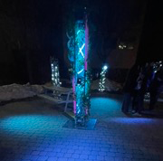](https://www.youtube.com/shorts/6Vedvg7-ClQ)

## Fonction du dispositif multimédia (scénographie, mise en valeur, mise en contexte, support pédagogique, diffusion du patrimoine immatériel)
Vue parlante - vidéo ou photo qui nous permet de bien comprendre la fonction du dispositif multimédia

## Mise en espace	
Vue d'ensemble de la pièce 

[Source de la photo](https://tim-montmorency.com/2023/projets/EDRIA/docs/web/index.html)

Dimensions 

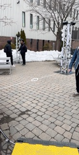
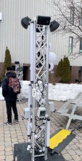
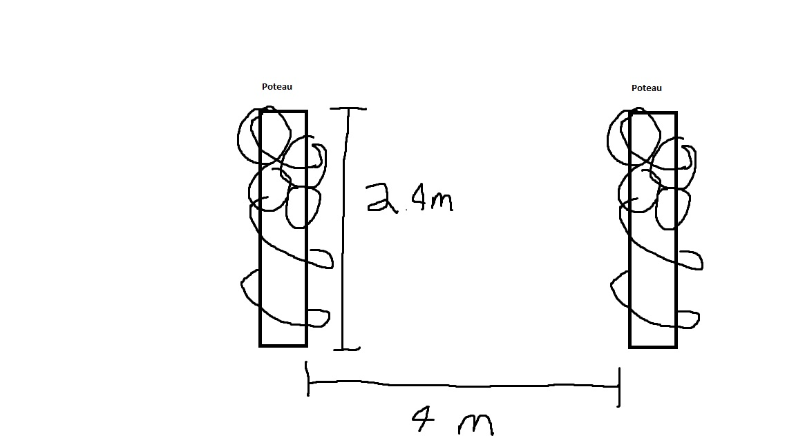
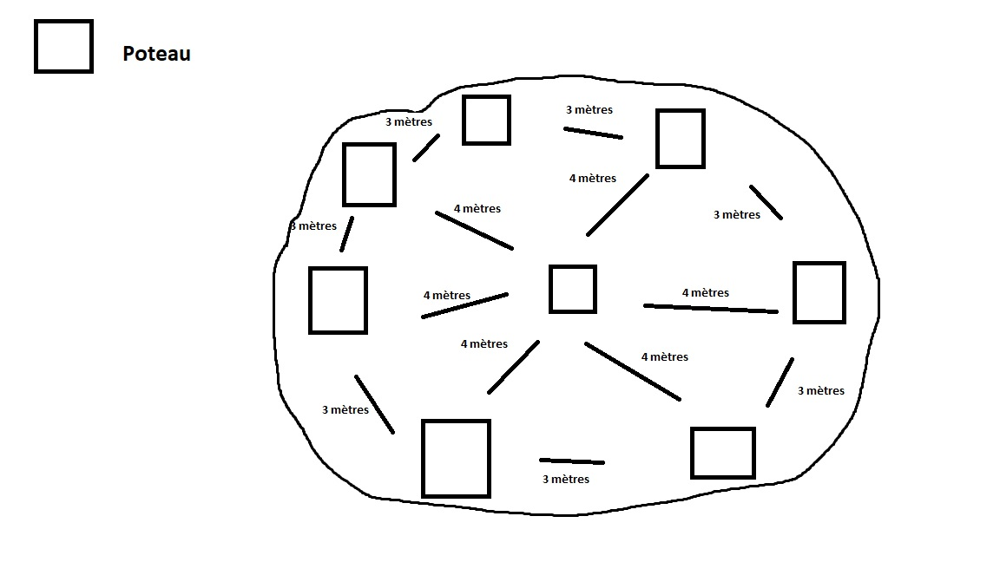

Edria fut installer sur une terrace à l'extérieur du Collège Montmorency. Cette terrace n'est qu'un simple parterre recouvert de briques qui sert comme mini-parc où les étudiants peuvent relaxer pendant leurs pauses. L'oeuvre fut disposé sur la bordure de cet parterre, de manière que les élèves puissent encore occuper l'espace.

## Composantes et techniques	
Parties composantes de l'oeuvre (il est possible d'utiliser des images tirées de sites internet pour faciliter la compréhension si les photos prises ne sont pas claires)	

Liste des composantes

* 9x Poteaux (pont d'éclairage, 8x 1' x 1' x 8' (triangle)
 et 1x 2' x 2' x 8' (carré) )
 
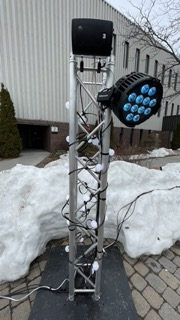

* 9x speaker

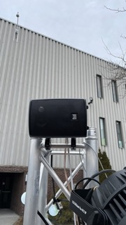

* 8x string festoon 15' (cr34te)

* 9x fausse plante

* 2x arduino

[Source de l'image](https://toptechboy.com/wp-content/uploads/2014/08/arduino.jpg)

* LED ALITOVE DC 12V WS2811 12mm

[Source de l'image](https://www.pinterest.ca/pin/686517536930406430/)

* Lumières adressables (x4)

* DMX Dot 5W (cr34te)

[Source de l'image](https://colordreamer.com.tr/category-architectural-lighting-dmx-dot?dil=5)

* 64x DMX DOT clean (cr34te)

[Source de l'image](https://american-illumination.com/led-fixtures/rgb-rgbw-color-changing-lighting/mini-dmx-dot/mini-dmx-dot-600x/)

* 20-25x Boule Lumineuse 200mm (cr34te)

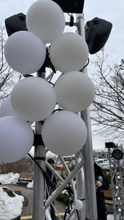

* 1x Boule Lumineuse 36' (cr34te)

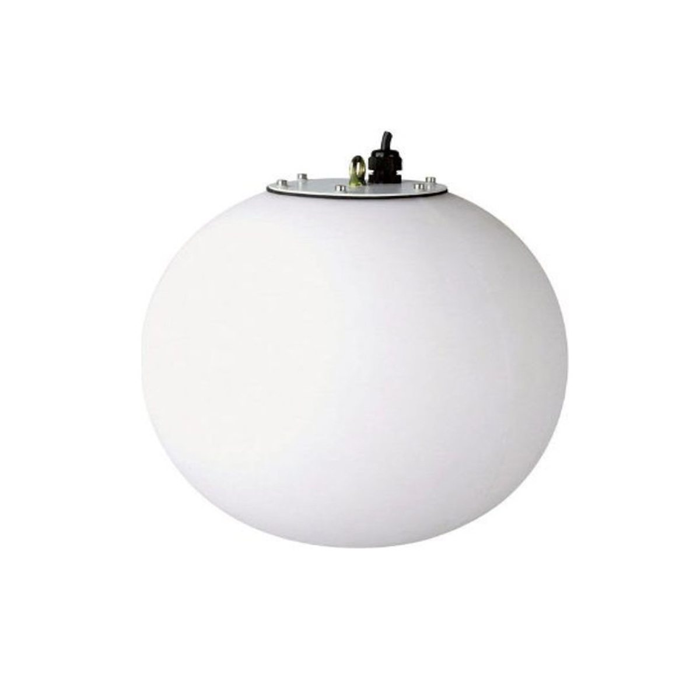

[Source de l'image](http://www.abclocation.fr/decoration/luminaire/boules-lumineuses-a-suspendre/boule-lumineuse-a-suspendre-diam-100cm)

* 4x Tubes Opal 0.5M (cr34te)

[Source de l'image](https://www.mwmaterialsworld.com/en/white-opal-acrylic-tube.html)

* 2x Tubes Opal 1M (cr34te)

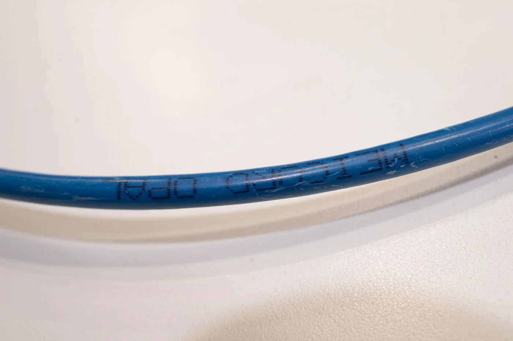

[Source de l'image](https://audiophilestyle.com/classifieds/item/817-meicord-opal-ethernet-cable-1m/)

* 8x COLORado 2 Solo (cr34te)

* Mac mini

[Source de l'image](https://www.walmart.com/ip/Mac-Mini-2011-Intel-core-i7-2-GHz-256GB-SSD-16GB-RAM-Mac-OS-High-Sierra-Refurbished/706556433)

* Carte de son

[Source de l'image](https://taodangmusic.com/10746-thickbox_default/sound-card-focusrite-scarlett-2i2-gen-3-.jpg)

* Amplificateurs

[Source de l'image](https://www.hippo-deals.com/pyle-home/120w-x-2-mini-stereo-power-amplifier-pta4-pid49291.html)

* V-Show Artnet RDM DMX Controller

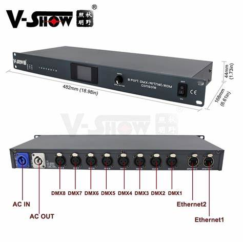

[Source de l'image](https://www.aliexpress.com/item/32869823005.html)

* Routeur

[Source de l'image](https://www.bhphotovideo.com/c/product/810050-REG/TP_Link_TL_WR841N_TL_WR841N_Wireless_Lite_N.html)

Techniques:
Les bases des poteaux peuvent facilement se dé-viser pour faciliter le transport. La majorité des éléments sont attacher avec des zip-ties ou avec des attache dévisable.

## Éléments nécessaires à la mise en exposition

Bancs

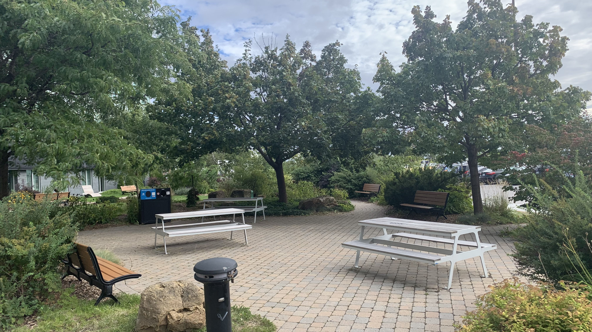

[Source de l'image](https://github.com/F-C-A/EDRIA/tree/main/docs/preproduction#mat%C3%A9riel-de-sc%C3%A9nographie-requis)

Couvre-fils (dos d'âne)

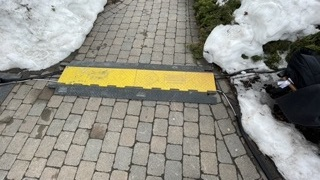

Ralonges Électriques/Protège Cables

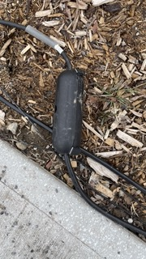

Cabanon de sécurité

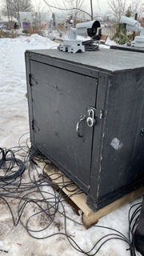

Cadena, Attaches et Zip-ties

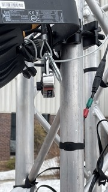

Caméra de sécurité

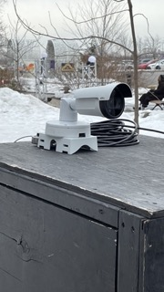

## Expérience vécue
Posture du visiteur ou gestes de l'interacteur 

Le visiteur pouvait avoir n'importe quelle posture qu'il voulait en autant qu'une partie de son corps fut détecté par un senseur.

Vidéo:

## ❤️ Ce que j'ai aimé et m'a inspiré
Ce qui m'a plu sont les différentes animations qui se passent dépendant d'oû on est placé plutôt qu'en avoir seulement une qui se passe tout le temps.
J'ai aussi aimé la disposition des poteaux, faisant en sorte qu'ils ne sont pas encombrant au élèves qui vont à la terrace.

## 🤔 Ce que je n'ai pas aimé et que je ne garderais pas
Je n'ai pas aimé l'emplacement de l'oeuvre, car elle a été placé à un endroit très fréquenté, faisant en sorte qu'on ne pouvait pas expérimenter l'oeuvre dans son entièreté puisqu'une partie était toujours enclenchée par une personne qui bougeait.

## Références		hyperliens vers les sites consultés
[EDRIA](https://github.com/F-C-A/EDRIA)

