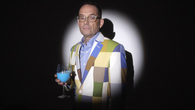
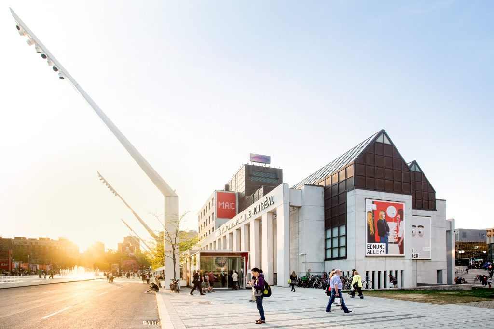
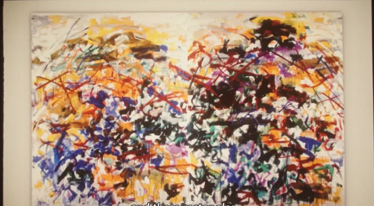
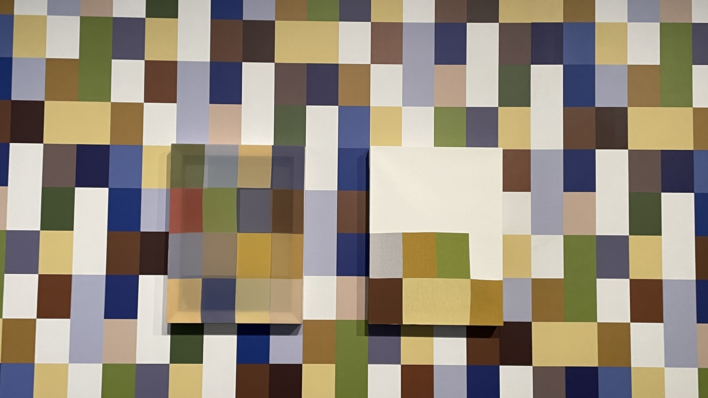
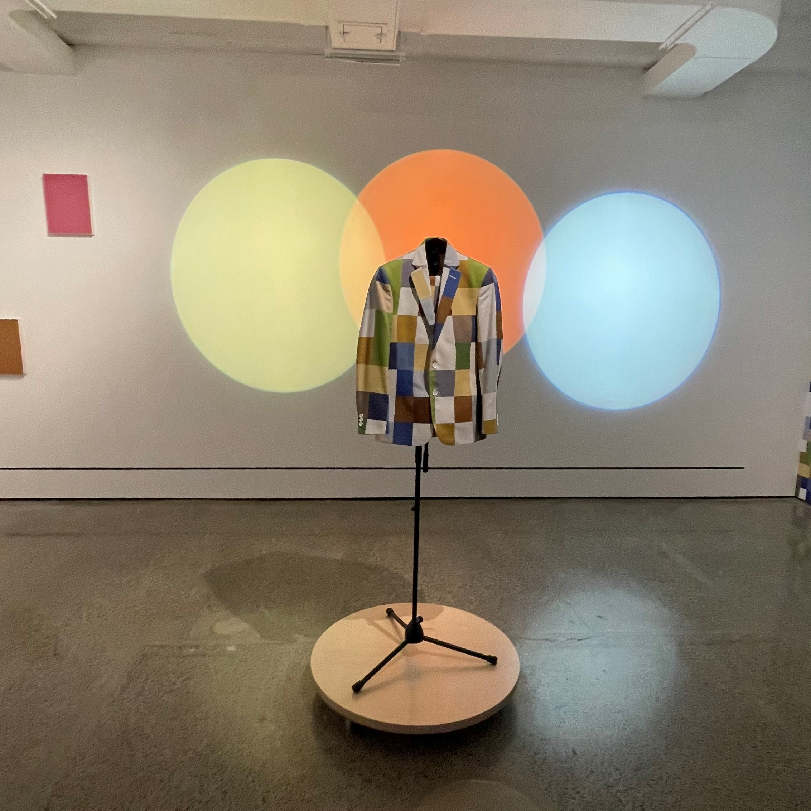
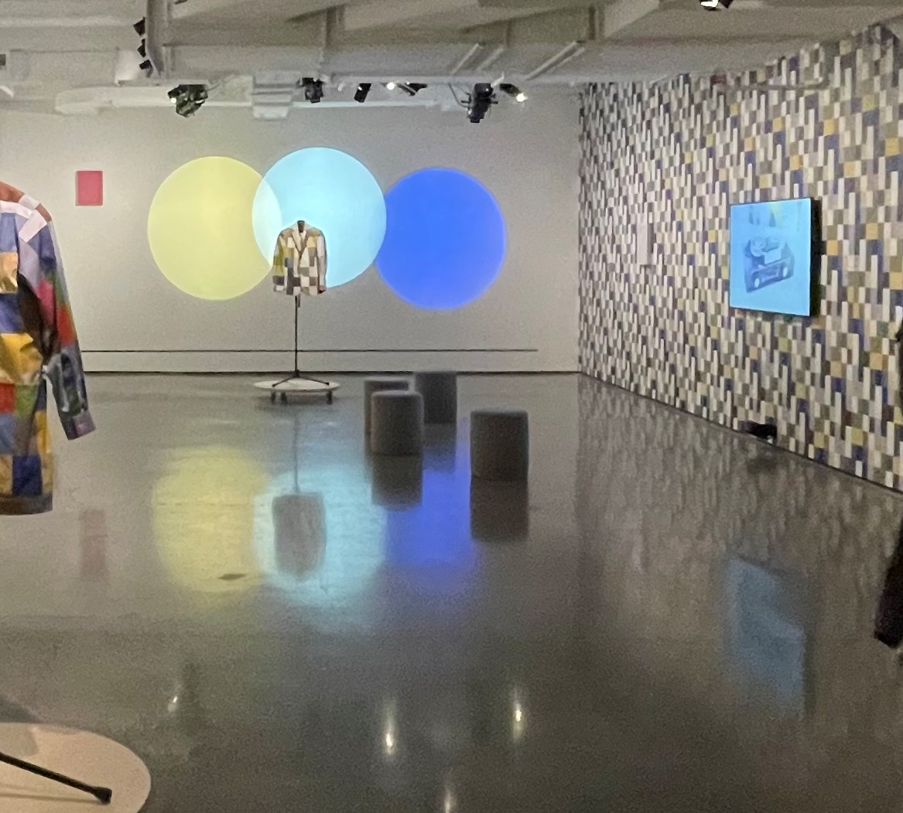
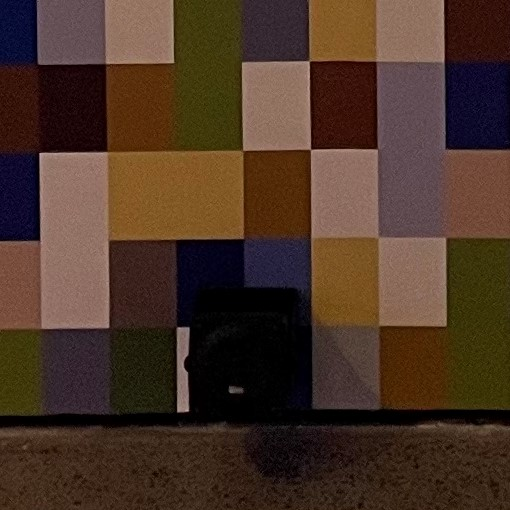
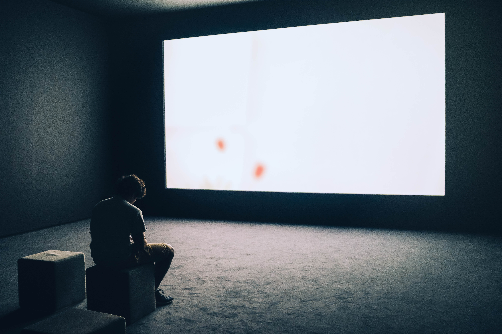

# Nelson Henricks - Des oeuvres inédites

[Source de l'image](https://www.quebec.ca/en/news/actualites/detail/montreal-artist-nelson-henricks-launches-exhibition-at-the-mac-along-with-selection-of-screen-tests-by-andy-warhol-44078)

## Lieu de mise en exposition
Musée d'art contemporain de Montréal

[Source de l'image](https://cultmtl.com/2020/06/the-mac-museum-montreal-is-reopening-june-24-with-free-admission/)

## Type d'exposition 
Temporaire (17 novembre 2022 - 10 avril 2023) et intérieur.

## Date de votre visite		
2 Mars 2023

## Titre de l'oeuvre
Don't You Like the Green of A?

## Nom de l'artiste
* Nelson Henricks

## Année de réalisation
2022

## Description de l'oeuvre	
Dont't You Like the Green of A? (N'aimes-tu pas le vert du A?) est basée sur les correspondances entre lettres et couleurs propres à la synthèsesie de Joan Mitchell, une condition que Henricks partage avec l'artiste. La synesthésie est une condition neurologique qui survient lorsque la perception par un sens déclenche automatiquement une perception dans l'un des autres sens. La connexion entre les différentes sens peut se manifester de multiples façons. Par exemple, dans la synesthésie graphème-couleur, des chiffres ou des lettres sont associés à des couleurs, tandis que les synestètes musique-couleur perçoivent de la couleur en entendant un son ou de la musique.

## Type d'installation
Contemplative

## Mise en espace	
Vue d'ensemble de la pièce 

Croquis de la mise en espace (plan ou élévation + dimensions)
Texte qui permet de comprendre comment l'oeuvre ou le dispositif est mis en espace : dans quelle pièce, sur quel mur, quel est l'espace occupé, comment est-ce disposé... ?

## Composantes et techniques	
Parties composantes de l'oeuvre (il est possible d'utiliser des images tirées de sites internet pour faciliter la compréhension si les photos prises ne sont pas claires)	

put pics here

Liste des composantes
* Moniteur
* Papier peint
* Impressions sur nylon
* Coton imprimé
* Métal
* Bois

Techniques

L'oeuvre de Nelson est entièrement en vidéo, donc il n'a pas vraiment besoin de rien transporter autre que son habit et sa banderole. Les éléments qui sont nécessaire, comme le moniteur, peut être facilement fournit par le prochain musée où sa prochaine exposition se tiendra. 

## Éléments nécessaires à la mise en exposition

* Lumière-projection

Bancs

Haut-parleur

## Expérience vécue
Posture du visiteur ou gestes de l'interacteur

Le visiteur est attendu de se placer devant le moniteur et de le regarder. Des bancs sont à sa disposition, mais il n'est pas obligatoire de l'utiliser. Le visiteur n'a rien à faire et la vidéo joue en boucle au-cas ou qu'il ait manqué le début.

[Source de l'image](https://www.pexels.com/photo/man-sitting-in-front-of-turned-on-screen-2736135/)

## ❤️ Coup de coeur
J'ai aimé l'absurdité de l'oeuvre. Elle peut être interpréter de millions de façon différentes, ou même juste être apprécié. Un autre point que j'ai apprécié est la simplicité de l'exposition: beaucoup d'artiste aime utiliser le plus d'espace possible, tandis que Nelson n'avait réellement besoin que d'une petite télévision.   

## 🤔 Aspect que vous ne souhaiteriez pas retenir pour vos propres créations ou que vous feriez autrement

**

## Références		hyperliens vers les sites consultés
[Musée d'art contemporain de Montréal](https://macm.org/expositions/nelson-henricks/)
[Vidéo de l'oeuvre](https://vimeo.com/767051865)

