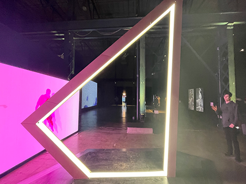
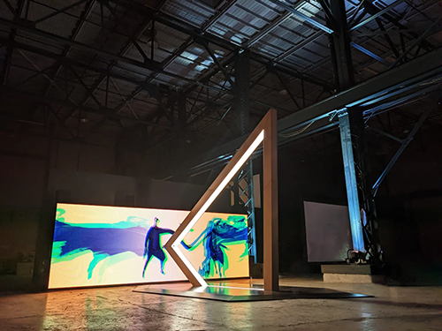
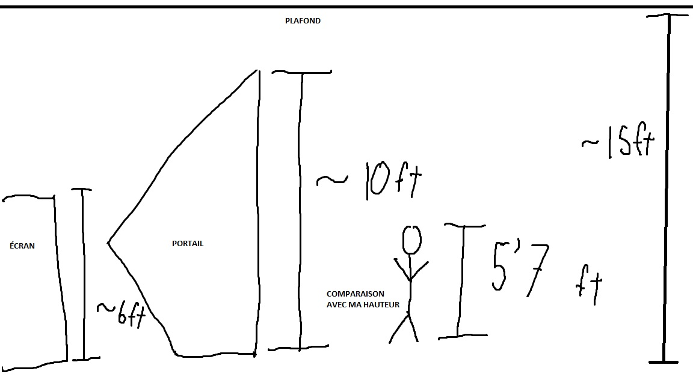
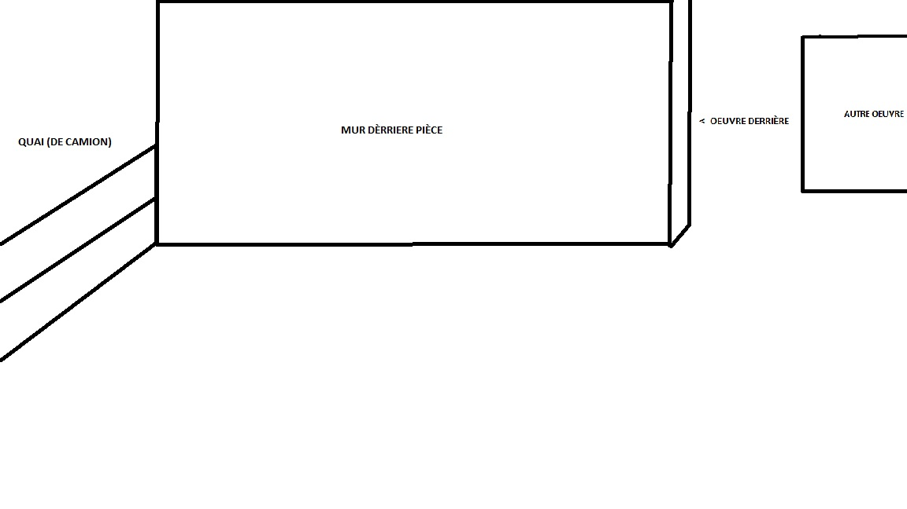
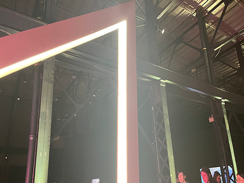
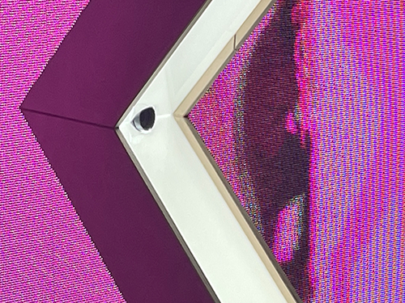
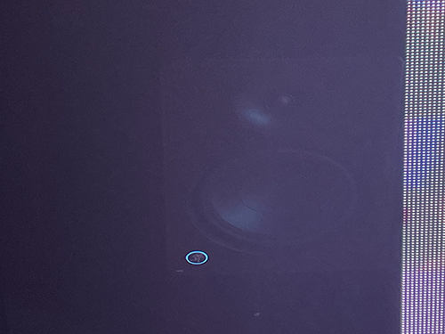
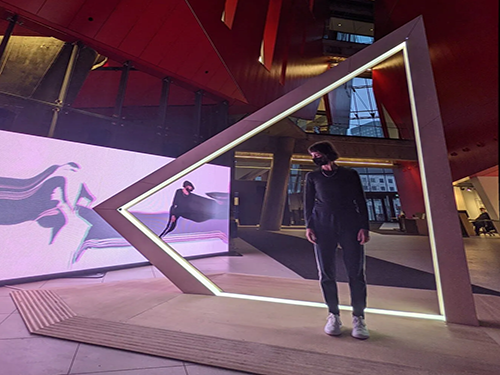

# BIAN

[Elektra](https://www.elektramontreal.ca/biennale2022)

## Lieu de mise en exposition
Arsenal art contemporain

## Type d'exposition 
Temporaire, intérieure.	

## Date de votre visite		
3 Février 2023

## Titre de l'oeuvre
RESONANCES

## Nom de l'artiste
Louis-Philippe Rondeau

## Année de réalisation
2021

## Description de l'oeuvre	
Résonances est une métaphore sur le temps qui défile. Au lieu d'exprimer la linéarité du temps, cette installation intéractive évoque la manière dont les gestes du présent se superposent à ceux du passé. Tel un écho visuel et sonore, elle représente nos actions antérieures qui resurgissent, amplifiant le présent et devenant à leur tour passé, telle une perpétuelle mise en abysme temporelle.    
[Source](médias/20230203_cartel.png)

## Type d'installation
Intéractive

[Vidéo vue parlante](https://youtube.com/watch?v=5C32gNSZBgM?)

## Mise en espace	
Vue d'ensemble de la pièce ([source de la photo à droite](http://patenteux.com/wp/portfolio/resonances-2021/))

Croquis de la mise en espace

Disposition

L'oeuvre est placé dans dans la pièce principale, directement à gauche de l'entrée. Elle est placée à coté d'un quai de chargement et devant un faux mur qui cache une autre oeuvre. Elle occupe un espace de 10x10 pieds carrés et elle est disposée d'une manière qu'une grande partie des composantes soit caché derrière elle.

## Composantes et techniques	
Parties composantes de l'oeuvre (il est possible d'utiliser des images tirées de sites internet pour faciliter la compréhension si les photos prises ne sont pas claires)	

Liste des composantes
* Portail en bois et acrylique
* Affichage DEL
* Lumière DEL blanche
* Ordinateur
* Caméra
* Haut-parleurs 

Techniques
* Écho visuel
* Portail diviser en plusieurs parties
* Écrans diviser en plusieurs panneaux
* Base en bois ou plastique en plusieurs parties

## Éléments nécessaires à la mise en exposition
Piliers pour soutenir les écrans

Cache-fils

"Sous-verres" pour que les écrans ne touches pas le plancher

## Expérience vécue
Posture du visiteur ou gestes de l'interacteur 

[Vidéo sur la posture](https://youtube.com/watch?v=5C32gNSZBgM?)

Il faut se positionner dans la périphérie de la caméra, soit le contour délimiter par la base surélevé. Il n'y a pas tellement de position attendu des intéracteurs, donc on peut faire n'importe quoi et  il y aura un résultat sur les écrans. L'oeuvre réagit en étirant une photo de l'inétracteur et en la fesant bouger comme une vague, ou une bande sonore. Personnellement, l'oeuvre m'a fait vivre de l'émerveillement et du questionnement, sur comment elle a pu modifier mon corps et comment elle l'a fait instantanément.

## ❤️ Ce qui vous a plu, vous a donné des idées
Ce qui m'a plu le plus est le thème de l'oeuvre, de montrer que les humains sont une catastrophes et s'autodétruisent en ayant une important préoccupation concernant leur apparence physique. L'artiste sait que beaucoup de gens ont un problème de dismorphie et son oeuvre en a pour thême mais, d'une façon où on peu en admirer ou rigoler. L'oeuvre nous permait de rire de notre apparence, sans réellement s'en préoccuper.
Si j'aurais à faire un projet intéractif dans le futur, je le ferais sur le même thème.

## 🤔 Aspect que vous ne souhaiteriez pas retenir pour vos propres créations ou que vous feriez autrement

Un aspect que j'aurais fait autrement est la forme du portail. Je trouve que sa haute forme triangulaire 'gaspille' beaucoup d'espaces non-utilisé. Le portail est environ 10 pieds de hauteur (qui est le double des écrans), et il a une largeur de 5 pieds qui ne peut pas être entièrement utilisé à cause de la courbe.
Il aurait été mieux que Louis-Philippe aie choisi une forme comme un cercle, un rectangle, ou même un parallélograme. Avec une forme plus petite, il aurait aussi plus de faciliter à la transporter.

## Références		hyperliens vers les sites consultés
http://patenteux.com/wp/portfolio/resonances-2021/
https://www.elektramontreal.ca/biennale2022
